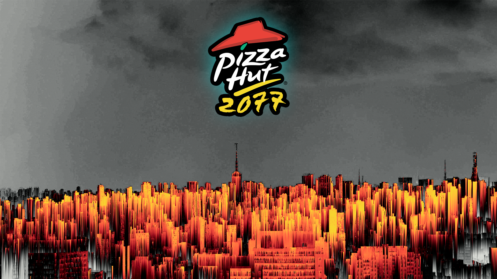

# Java-FWP-AI-B6-Projekt



> Domino's Pizza® dominiert die Dystopie Düsburgs.
> Kann Pizza Hut® den Ruf der runden Fressalien retten?
> Begib dich zur Auslieferung an die Front und beweise deine italienischen Wurzeln!

---

## JavaDoc

Die aktuelle Dokumentation kann hier gefunden werden: [`click`](https://htmlpreview.github.io/?https://github.com/SenpaiSimon/Java-FWP-AI-B6-Projekt/blob/main/javadoc/apidocs/index.html)

---

## Kompilieren

Das Projekt benutzt [`Java 18`](https://www.oracle.com/java/technologies/javase/jdk18-archive-downloads.html), [`maven`](https://maven.apache.org) und `JavaFX`.

Zum Ausführen der Applikation aus dem root Verzeichnis:
```bash
$ mvn clean package exec:java
```

Die resultierende `JAR` ist unter `./target` mit dem Suffix `-jar-with-dependencies.jar` anzufinden.

Das Projekt wurde mit [microsoft visualstudio code](https://code.visualstudio.com) erstellt. Die Ausführung und Bearbeitung unter Eclipse oder IntelliJ wurde nicht getestet.

## Steuerung

| Taste | Funktion |
| --- | --- |
| `Q` | Spiel Starten |
| `E` | Shop betreten/verlassen |
| `esc` | Spiel schließen |
| `A` | Links bewegen |
| `D` | Rechts bewegen |
| `Leertaste` | Springen |
| `Maus` | Schießen |

## Autoren

| Name | Matr. Nr. |
| --- | --- |
|Robin Prillwitz | `00805291`|
|Simon Obermeier | `00800498`|
|Anton Kraus | `00804697`|

---

## Requirements

> Eine Java-Anwendung für ein kleines Anwedungszenario

*Notwendig*:
- [x] Vererbung
- [x] Interface
- [x] Javadoc Kommentierung

*Besondere Herrausforderung*:
- [x] GUI mit `JavaSwing` oder `JavaFX`
- [x] Lauffähge `JAR` Datei
- [ ] relationale Datenbank (Gewünscht)

---

Das Projekt wird nicht von Pizza Hut, LLC oder Domino's Pizza, Inc. unterstützt.
